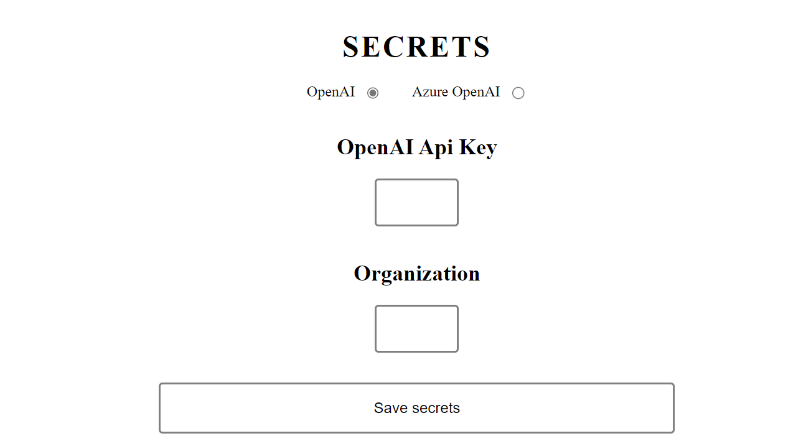

# This is the original Voxura demo (Speech-To-Form)

Usage:
- In the terminal:
    - `npm install`
    - `npm run dev`
    - Open the browser with the port indicated in the terminal, or just press the "o" key

- Once the project is opened in the browser, the Secrets page should be shown. Select OpenAI, and enter your OpenAI key and optionally your organization. (this will be stored on your computer for the next run)

- To use the Azure OpenAI endpoints, you have to edit the code as only the key is input in the Secrets page, the endpoint is hardcoded in the code.

- Click the `Save secrets` button 

- The main form should appear. 

- Press the `start` button to start the speech recognition. You may have to allow the browser to use the microphone.

- Start speaking, such as "I am John Smith, and I'd like to BUY 20000 USD with a start date of March 2, 2024...", etc to fill the form

- Use the language dropdown to change languages (currently supports English and Hungarian)

- Press the `debug` button to see under the hood and tweak additional settings.
