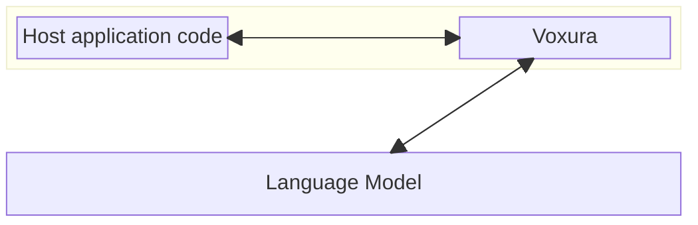
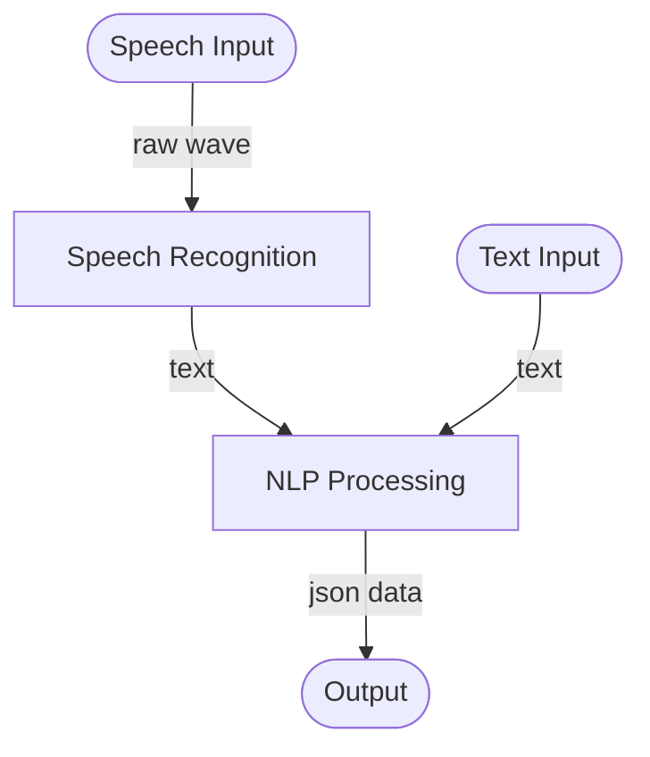

# _Voxura_ Architecture

_Note_: This is the very first draft of the architecture document. It is a work in progress and will be updated as the project progresses.

## Goals
The overall goals of the Voxura architecture are to:
- Facilitate a wide range of use cases within the domain of real time speech insights and data extraction
- Provide a component-based architecture that allows for easy integration and switching of various speech recognition engines, data extraction strategies and language models
- Act as a local or remote component inside a host application, such as a web application, a mobile app, a desktop app or a kiosk built with a variety of technologies
- Provide a resonably flexible pipeline for extracting data from speech, with multiple entry points
- Ensure the security and privacy requirements of the host application are met

## The Big Picture

_Voxura_ is either embedded within a host application, or is used as a cloud service. The host application feeds _Voxura_ with raw speech or text, and _Voxura_ returns JSON data containing the extracted data. The host application can then use this data to update its state, or to display it to the user.

_Voxura_ embedded:
   

_Voxura_ as a cloud service:

## The _Voxura_ Pipeline

Speech processing within _Voxura_ is linear, using a pipeline of components. The overall pipeline consists of the following steps:

The individual components of the pipeline are swappable (except for the `NLP Processing` component). The `NLP Processing` component is the heart of the system, so it cannot be replaced for now - but it is highly configurable.

### Speech Input
The speech input component is responsible for capturing the raw speech waveform (e.g .wav) from the user. This can be done using a variety of technologies, such as a microphone, a web browser's WebRTC API, or a pre-recorded audio file. 

### Speech Recognition
The speech recognition component is responsible for converting the raw speech waveform into text. This can be done using a variety of speech recognition engines, such as the ones built into web browsers, operating systems, cloud / remote services or local AI models, such as Whisper.

### Text Input
It is possible to bypass the speech input and speech recognition components and feed the pipeline with text directly. This can be useful for testing, or for use cases where the text is already available, such as chatbots or text-based interfaces, or client-based speech recognition.

### NLP Processing
The NLP processing component is responsible for extracting data from the text. For the first versions of _Voxura_, this will happen using GTP-3.5 Turbo and similar language models, but configuration options will allow for the use of other language models (local and remote).

### Output
The output of the pipeline is a JSON data structure containing the extracted data in a format specified NLP_processing component's configuration. This JSON data can be a full set of extracted data, or just a partial piece, reflecting the changes instructed by the latest piece of text.

## Speech / Text Streaming
A key feature of _Voxura_ is the ability to process speech and text in real time. This means that the pipeline can be fed with a continuous stream of speech or text, and the output will be a continuous stream of JSON data. 

Taking into account how speech recognition engines work, it is also possible to "go back in time" and refine previous pieces of text, which will result in the output updating fields that were previously extracted. 

This continous updating of the output also allows the speaker to correct themselves at any time.

## Security and Privacy
_Voxura_ is designed to be a secure and privacy-respecting component. It will only store the extracted data if instructed to do so by the host application, for debugging / testing purposes.

## Cloud vs Local
_Voxura_ will be developed as a local component, but a wrapper will be developed to allow it to be used as a cloud service. Authorization and authentication will be the responsibility cloud wrapper, in coordination with the host application.

# Platform Support
Voxura will be developed using .Net Core. It is widely supported as a hosted platform across all major cloud providers, has extensive ecosystem and Microsoft is a FINOS member. 

Choosing .Net Core allows the following scenarios:

| Scenario                                | Voxura is Embedded | Voxura is used via cloud |
|-----------------------------------------|--------------------|--------------------------|
| .Net client (desktop) application       |         ✔️         |           ✔️            |
| .Net server application                 |         ✔️         |           ✔️            |
| Web client technologies                 |         ❌         |           ✔️            |
| Web server technologies (e.g. NodeJS)   |         ✔️         |           ✔️            |
| Various mobile applications             |         ❌         |           ✔️            |
